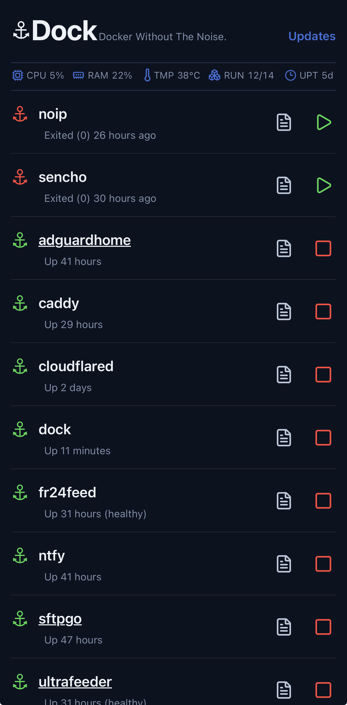

# ⚓ Dock

**A lightweight Docker management console built for everyday use.**

Dock is a fast, minimal web interface for managing Docker containers on Linux servers.

It was designed from the ground up to run continuously on low-power systems such as Raspberry Pi, with a strong focus on simplicity, low resource usage and a clean user experience.

No heavy management stack.  
No unnecessary background services.  
Just the tools you need to manage your containers.

## Why Dock?

Many container management platforms provide hundreds of features — and require significant resources to do it.

Dock takes a different approach.

Its goal is to provide the operations you actually use every day while remaining almost invisible to the system it manages.

**Lightweight. Fast. Secure. Elegant.**

## Features

### Container management

View all Docker containers from a single interface and quickly:

- Start containers
- Stop containers
- Restart containers
- Inspect container state
- View container logs

### System overview

Dock provides an at-a-glance view of the host:

- CPU usage
- Memory usage
- System temperature
- System uptime
- Running / total containers

### Image update detection

Dock checks whether newer container images are available without automatically downloading them.

Supported registries:

- Docker Hub
- GitHub Container Registry (GHCR)

Updates remain under your control.

### Compose-aware updates

For containers managed with Docker Compose, Dock can locate the Compose project and perform controlled image updates directly from the interface.

### Docker cleanup

The Maintenance page provides Docker storage information and safe cleanup tools.

Before cleanup, Dock shows the current Docker resource usage so you can see what can be reclaimed.

## Built for small servers

Dock was originally designed with Raspberry Pi and always-on home servers in mind.

Performance is treated as a feature:

- Minimal CPU usage while idle
- Low memory footprint
- Minimal disk activity
- Minimal network activity
- No unnecessary polling
- Small dependency footprint
- Single Go application

If a feature can be implemented simply, Dock deliberately avoids the more complex solution.

## Architecture

Dock is written in Go and follows a small modular architecture.

- `cmd/` — Application entry point
- `internal/` — Application services, Docker integration, system monitoring, update engine and HTTP server
- `web/` — Web interface, templates and static assets
- `config/` — Configuration
- `docs/` — Technical documentation

The Docker layer is isolated behind a service interface, keeping the rest of the application independent from the Docker implementation.

## Requirements

- Linux
- Docker Engine
- Docker Compose v2
- Access to the Docker socket

Dock is particularly well suited for Raspberry Pi, home servers, mini PCs, NAS systems, homelabs and lightweight VPS installations.

## Docker installation

The official multi-architecture image is published on GitHub Container Registry:

    ghcr.io/lbarreiro/dock:latest

Supported architectures:

- linux/amd64
- linux/arm64

Clone the repository:

    git clone https://github.com/lbarreiro/dock.git
    cd dock

Set `COMPOSE_ROOT` to the directory containing your Docker Compose projects while preserving their absolute host paths.

For example:

    COMPOSE_ROOT=/home/user docker compose up -d

Dock requires access to the Docker socket in order to manage the host Docker Engine.

The Compose project directories are mounted read-only. This allows Dock to locate Compose files for controlled container updates without modifying them.

## Security

Dock does not require Docker registry credentials to check public images.

Registry authentication tokens used for public image metadata are obtained dynamically from the corresponding registry services.

As with any Docker management interface, access to Dock should be restricted to trusted networks or protected by an appropriate authentication or reverse-proxy layer.

## Development

Dock is written in Go.

Clone the repository, enter the project directory and build the application with:

    go build -o dock ./cmd/dock

For local development:

    ./dev.sh

## Documentation

Technical documentation is available in the `docs/` directory.

It covers architecture, modules, UI principles, design decisions and the project roadmap.

## Project status

Dock is under active development.

The core container management, system monitoring, update detection and maintenance functionality is operational.

Additional functionality will be introduced while preserving Dock's lightweight design.

## Contributing

Contributions, bug reports and suggestions are welcome.

See `CONTRIBUTING.md` for project guidelines.

## License

See `LICENSE` for licensing information.

---

**Dock — Docker management without the weight.**
